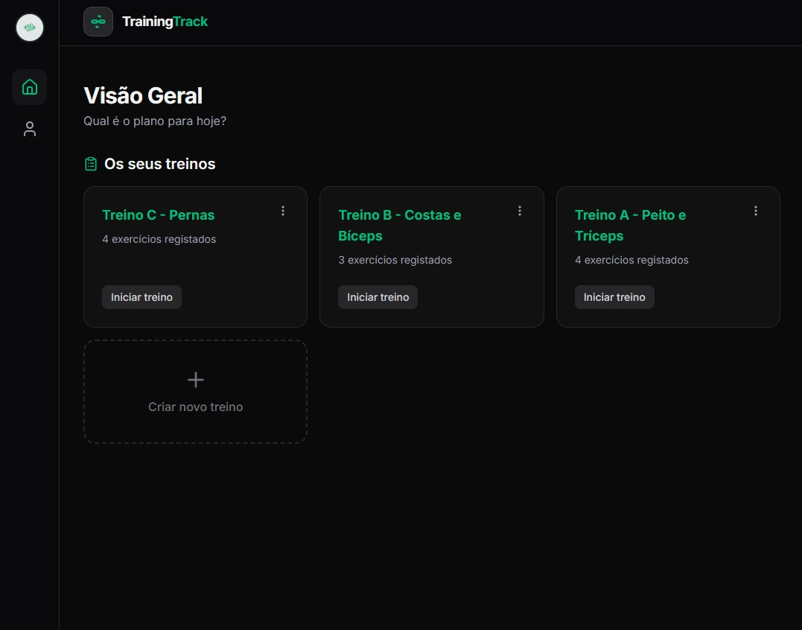
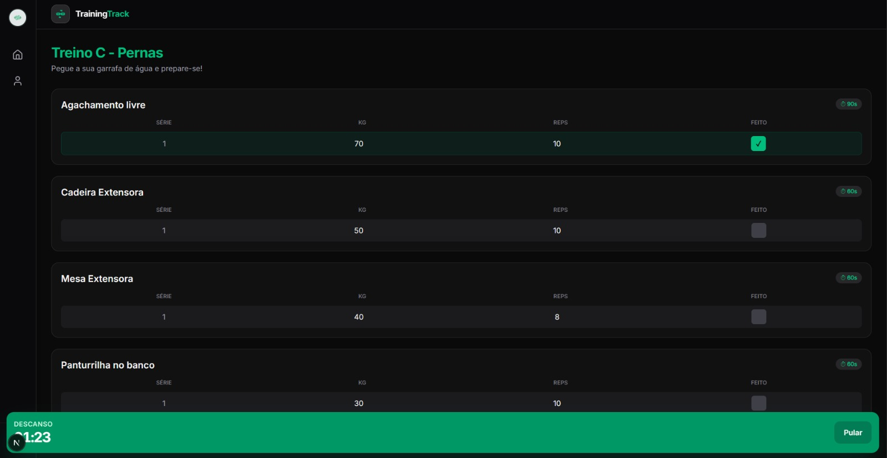
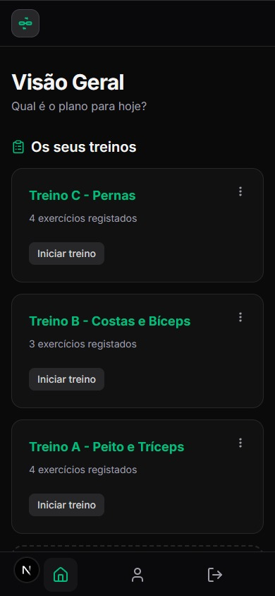

<div align="center">
  <h1>🏋️‍♂️ Training Track</h1>
  <p><strong>Seu parceiro digital para otimizar e registrar suas rotinas de musculação.</strong></p>
  <p>Crie treinos personalizados, acompanhe suas séries, controle o tempo de descanso e foque no que realmente importa: seu progresso.</p>

  <a href="https://training-track-psi.vercel.app" target="_blank">
    
  </a>

<br/><br/>


</div>

---

<div align="center">
  
  
  
</div>

---

## 📋 Índice

- [Sobre o Projeto](#-sobre-o-projeto)
- [Funcionalidades](#-funcionalidades)
- [Tecnologias](#-tecnologias)
- [Como Rodar Localmente](#-como-rodar-localmente)
- [Conta de Demonstração](#-conta-de-demonstração)
- [Licença](#-licença)

---

## 💡 Sobre o Projeto

O **Training Track** nasceu da necessidade de ter um controle simples e eficiente sobre rotinas de musculação. Em vez de cadernos ou planilhas, a ideia é ter uma interface rápida e intuitiva para registrar treinos, acompanhar evolução de carga e manter o ritmo com um cronômetro de descanso integrado.

---

## 🚀 Funcionalidades

- **📝 Criação de Treinos Dinâmicos** — Monte rotinas de forma flexível, adicionando ou removendo exercícios com facilidade.
- **💪 Gestão de Séries e Repetições** — Defina séries, repetições e carga (kg) para cada exercício.
- **⏱️ Cronômetro de Descanso Integrado** — Temporizador automático para manter a consistência entre as séries.
- **🔐 Autenticação de Usuários** — Crie sua conta e acesse seus treinos salvos de qualquer lugar.

---

🚀 Acesse a Aplicação
Link: [Coloque o link do seu site aqui]

Para testar a aplicação rapidamente com dados preenchidos, sinta-se à vontade para usar a conta de demonstração abaixo:

E-mail: demonstration@treinoapp.com
Senha: Demo@treino123

(Ou, se preferir, você pode criar a sua própria conta do zero para testar o fluxo de autenticação e validações!)

## 🛠️ Tecnologias

| Tecnologia                                                                         | Função                                 | Versão |
| ---------------------------------------------------------------------------------- | -------------------------------------- | ------ |
| [Next.js](https://nextjs.org/)                                                     | Framework principal                    | 15     |
| [TypeScript](https://www.typescriptlang.org/)                                      | Linguagem                              | 5      |
| [React](https://react.dev/)                                                        | Biblioteca UI                          | 19     |
| [Supabase](https://supabase.com/)                                                  | Backend, banco de dados e autenticação | -      |
| [Zustand](https://zustand-demo.pmnd.rs/)                                           | Gerenciamento de estado                | -      |
| [React Hook Form](https://react-hook-form.com/)                                    | Gerenciamento de formulários           | -      |
| [Tailwind CSS](https://tailwindcss.com/)                                           | Estilização                            | 4      |
| [Lucide React](https://lucide.dev/)                                                | Ícones                                 | -      |
| [Jest](https://jestjs.io/) + [React Testing Library](https://testing-library.com/) | Testes                                 | -      |

---

## ⚙️ Como Rodar Localmente

### Pré-requisitos

- [Node.js](https://nodejs.org/) v20 ou superior

### 1. Clone o repositório

```bash
git clone https://github.com/seu-usuario/training-track.git
cd training-track
```

### 2. Instale as dependências

```bash
npm install
```

### 3. Configure as variáveis de ambiente

Crie um arquivo `.env.local` na raiz do projeto com as chaves do seu projeto Supabase:

```env
NEXT_PUBLIC_SUPABASE_URL=SUA_SUPABASE_URL
NEXT_PUBLIC_SUPABASE_ANON_KEY=SUA_SUPABASE_ANON_KEY
```

> Você encontra essas chaves em **Supabase → Project Settings → API**.

### 4. Configure o banco de dados

Execute as migrations para criar as tabelas necessárias no seu projeto Supabase:

```bash
npx supabase db push
```

> Caso não esteja usando a CLI do Supabase, você pode rodar os scripts SQL manualmente a partir da pasta `/supabase/migrations`.

### 5. Inicie o servidor de desenvolvimento

```bash
npm run dev
```

Acesse [http://localhost:3000](http://localhost:3000) no seu navegador.

---

## 🔑 Conta de Demonstração

Para explorar a aplicação com dados já preenchidos, use a conta de demonstração:

| Campo  | Valor                |
| ------ | -------------------- |
| E-mail | `demo@treinoapp.com` |
| Senha  | `demo1234`           |

> ⚠️ Os dados desta conta são públicos e podem ser resetados periodicamente. Para testar o fluxo completo de cadastro e validações, recomendamos criar sua própria conta.

---

## 📁 Estrutura do Projeto

```
training-track/
├── app/                  # Rotas e páginas (Next.js App Router)
├── components/           # Componentes reutilizáveis
├── store/                # Estado global com Zustand
├── lib/                  # Configurações e utilitários (ex: cliente Supabase)
├── supabase/             # Migrations e configurações do banco
└── __tests__/            # Testes unitários e de integração
```

---

## Testes E2E com Playwright

### Pré-requisitos

- Instalar dependências do projeto (`npm install`)
- Configurar variáveis de ambiente da aplicação (`.env.local`)
- Criar um arquivo `.env.e2e` com base em `.env.e2e.example`
- Preencher `E2E_USER_EMAIL` e `E2E_USER_PASSWORD` com uma conta dedicada de teste

### Instalação do Playwright

```bash
npm i -D @playwright/test
npx playwright install
```

### Scripts disponíveis

```bash
npm run test:e2e         # Executa toda a suíte em headless
npm run test:e2e:ui      # Abre UI mode interativo do Playwright
npm run test:e2e:headed  # Executa com navegador visível
npm run test:e2e:report  # Abre o relatório HTML da última execução
```

`npm run test:e2e` agora carrega automaticamente as variáveis de `.env.e2e` via `dotenv` no `playwright.config.ts`.

### Cenários smoke implementados

- Redirecionamento de usuário não autenticado para `/login`
- Validação de campos obrigatórios no login
- Login com conta de teste (quando `E2E_USER_EMAIL`/`E2E_USER_PASSWORD` estiverem definidos)
- Criação de treino e validação na dashboard com título único por execução

### Depuração e troubleshooting

- Rode `npm run test:e2e:ui` para inspecionar passos e seletores.
- Em falhas, abra o relatório com `npm run test:e2e:report`.
- Prioridade de variáveis: ambiente do processo/CI > `.env.e2e` local.
- Os testes autenticados são automaticamente ignorados quando variáveis de auth E2E não estiverem configuradas.

---

## 🤝 Contribuindo

Contribuições são bem-vindas! Sinta-se à vontade para abrir uma _issue_ reportando bugs ou sugerindo melhorias, ou enviar um _pull request_ diretamente.

1. Faça um fork do projeto
2. Crie uma branch para sua feature (`git checkout -b feature/minha-feature`)
3. Commit suas mudanças (`git commit -m 'feat: minha nova feature'`)
4. Push para a branch (`git push origin feature/minha-feature`)
5. Abra um Pull Request

---

## 📄 Licença

Este projeto está sob a licença MIT. Veja o arquivo [LICENSE](./LICENSE) para mais detalhes.

---

<div align="center">
  Feito com 💪 por <a href="https://github.com/AdrianoCordeiro-SQL">AdrianoCordeiro-SQL</a>
</div>
